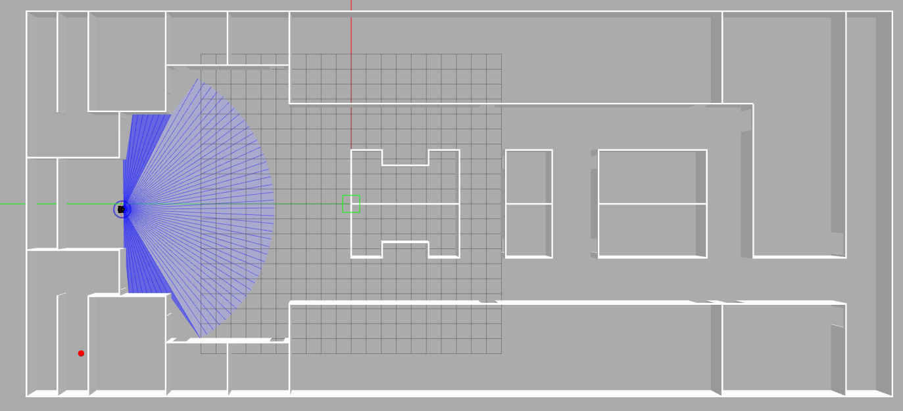
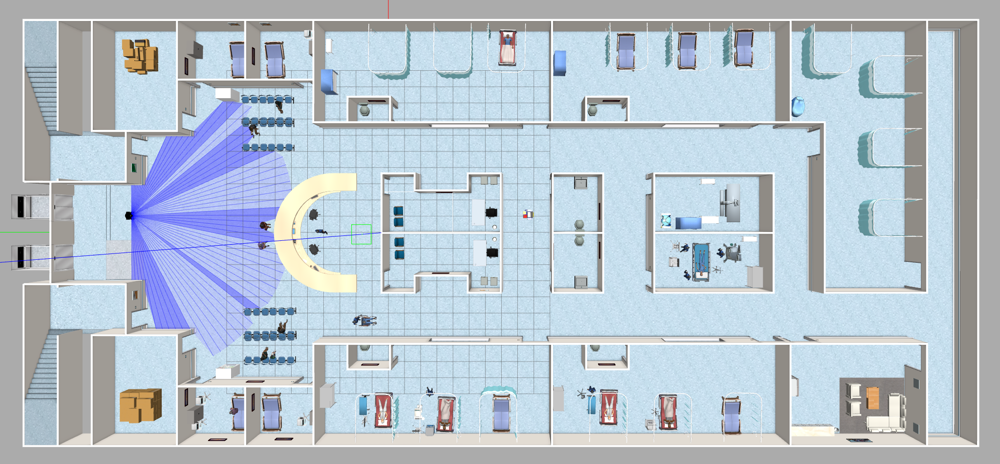
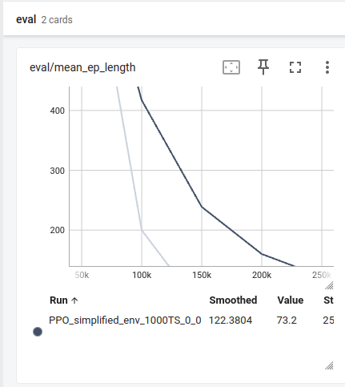
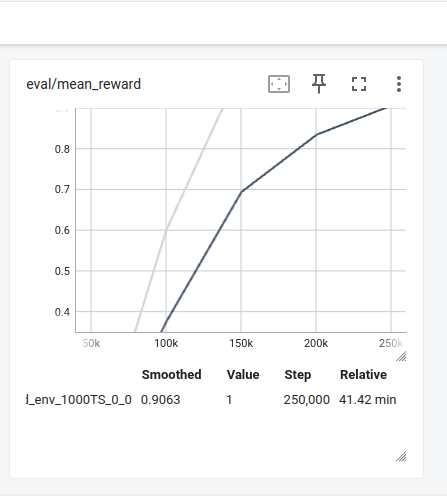
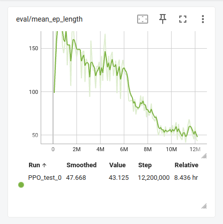
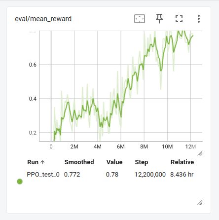
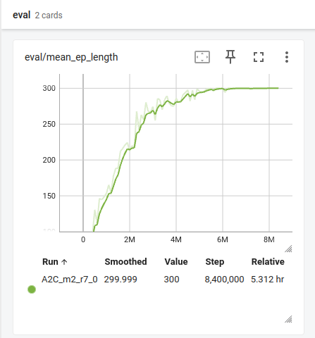
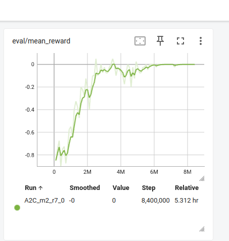

# RL-Short-Range-Path-Planning
This repository demonstartes, RL based path planning for short range given a target state (pose). The robot is equipped with a 2D Lidar sensor, RL-based path planner provides optimal paths to given target pose independent of map environmennt.

<!-- ABOUT THE PROJECT -->

This project is an extension of the 
<a href="https://github.com/TommasoVandermeer/Hospitalbot-Path-Planning.git" target="_blank">Hospitalbot path planning</a>
## Introduction

Path planning of robot in an indoor environment is a crucial task of autonomous navigation, where the robot subsequently plans path from its initial state to a target state in a grid or map. Many of the path planning algorithms are not actually used on real-time robots due to its computational demands and high dimensional problems. As the advancement in Robotics, Deep Reinforcement Learning (DRL) provides a powerful tool to provide optimal path planning in deterministic indoor environments. In comparison of classical path planning algorithms, reinforcement learning (RL) based approaches have received significant attention in the recent past due to the success of the deep learning.
We provide a report for the RL based path planning for short range given a target state (pose). The robot is equipped with a 2D Lidar sensor, RL-based path planner provides optimal paths to given target pose independent of map environmennt. Our contribution is to plan paths using Proximal Policy Optimization (PPO) and Actor Critic (A2C) implementation.

## Environemnt Setup

Simplified Environment           | Complex Environment           
:-------------------------:|:-------------------------: 
  | 

## Result in Simplified Environment 
Mean Episode Length         | Mean Reward          
:-------------------------:|:-------------------------: 
  | 

### Analysis : 
In-case of PPO in training performance we got mean reward more than 0.8 as shown in graph above, for the simplified environment and the mean episode length converged to 73.2, which states that agent was successful in not only planning the path from spawn location to designated goal location but also finding the optimum path eventually.

## Result in Complex Environment : PPO
Mean Episode Length         | Mean Reward          
:-------------------------:|:-------------------------: 
  | 

### Analysis : 
For complex environment the PPO algorithm, initially for 5 million training steps gave unsatisfactory results of 0.4 rewards but after around 6 million training steps the agent showed good rise in the reward and after 12 million training steps final reward was of 0.78 and mean episode length converged to 43, which was better than the result from simplified environment.
This demonstrates that with more number of training steps this algorithm can perform better with finding optimum path between start to goal. Which illustrates that PPO is suitable for short range path planning application.

## Result in Complex Environment : A2C
Mean Episode Length         | Mean Reward          
:-------------------------:|:-------------------------: 
  | 

### Analysis : 
On the other hand, A2C has not shown promising results in terms of planning path to goal location though the agent learned to prolong the episode length and navigate in the environment avoiding obstacles.  Fig. 9 shows that the mean episode length value was 300 (the maximum episode length) after the 8.4 million training steps and the reward which was initially negative till 3 million steps converged to 0 reward. The potential reason can be the sparse reward of attaining goal. The inference is supported by simulation as well.

## Conclusion 
We designed two environments - a simplified and a complex one, with the later featuring more obstacles than the former. In our experiments, the Proximal Policy Optimization with Clip (PPO-Clip) algorithm demonstrated superior performance compared to the Advantage Actor-Critic (A2C) algorithm in both environments.
